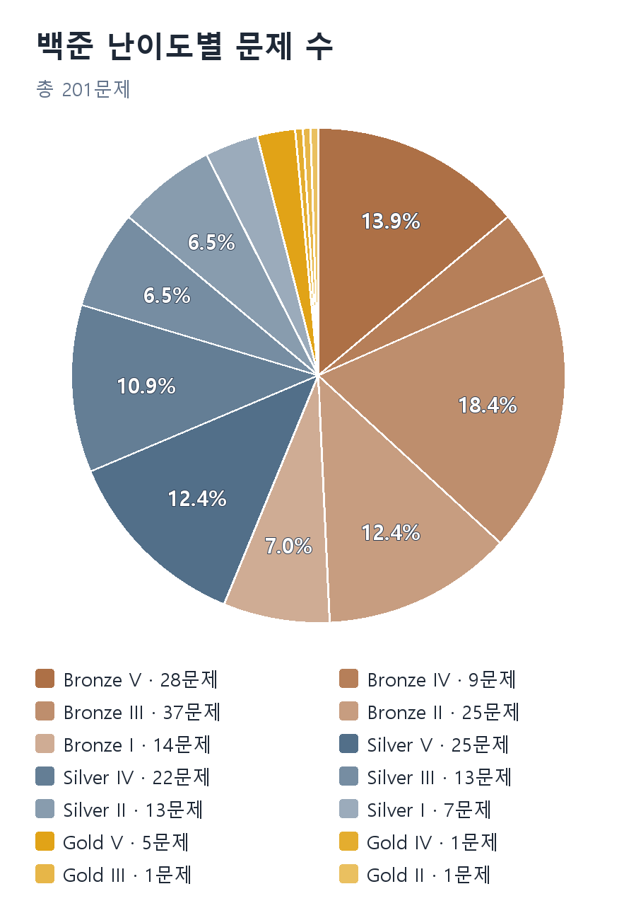
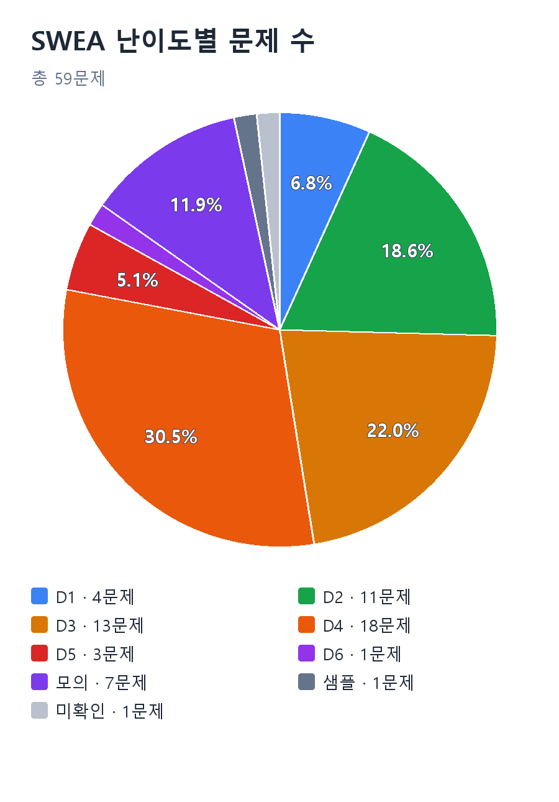
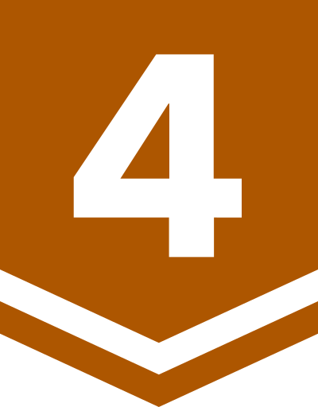
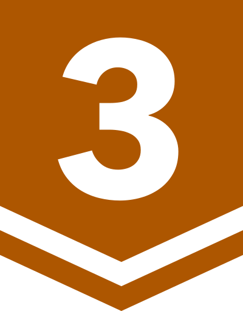
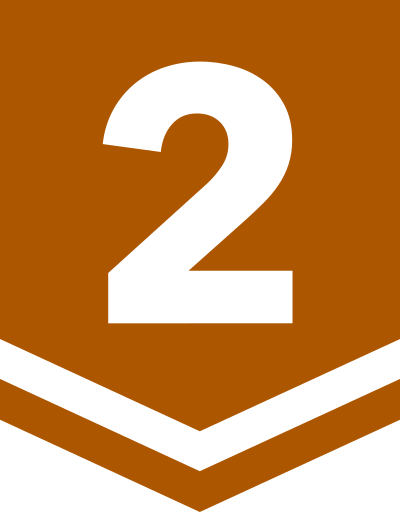
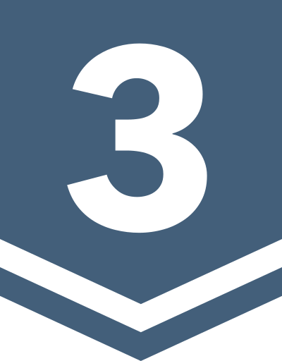
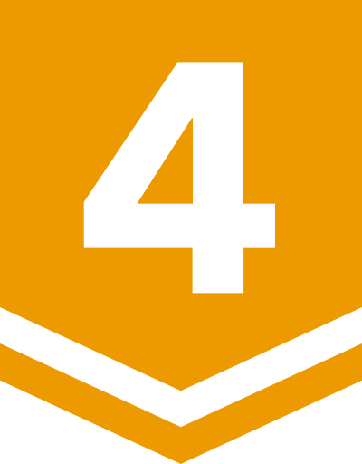
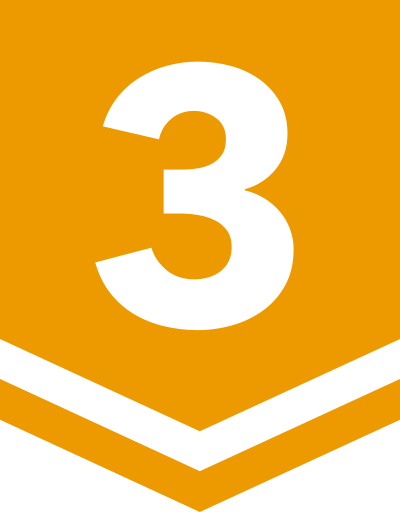
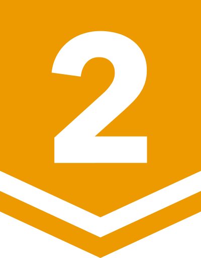

# 알고리즘 문제 풀이

<!-- 푼 날짜: 코드의 작성일 주석을 우선 사용하고, 없으면 파일의 최초 추가 커밋 날짜를 사용함. 실제 정답 제출일은 별도 확인하지 않음. -->

<!-- 난이도 확인: 2026-10-07. BOJ: https://github.com/Hiyabye/solvedac/tree/main/data 의 solved.ac 수집 기록. 티어 기준: https://help.solved.ac/en/problem/level . 원본 아이콘: https://d2gd6pc034wcta.cloudfront.net/tier/{level}.svg (저작권 solved.ac). SWEA: 공식 Problem/User Problem 검색 목록. D 배지는 자체 제작이며 —는 난이도 미확인 또는 등급 없음. -->

## 통계

<table>
  <tr>
    <td width="50%" valign="top">
      <picture>
        <source media="(prefers-color-scheme: dark)" srcset="assets/statistics/boj-difficulty-dark.png">
        
      </picture>
    </td>
    <td width="50%" valign="top">
      <picture>
        <source media="(prefers-color-scheme: dark)" srcset="assets/statistics/swea-difficulty-dark.png">
        
      </picture>
    </td>
  </tr>
</table>

## Java (79문제)

| 난이도 | 제목 | 푼 날짜 | 알고리즘 |
| :---: | --- | --- | --- |
|  | [SWEA 5251. 최소 이동 거리](Java/swea/5251_%EC%B5%9C%EC%86%8C%20%EC%9D%B4%EB%8F%99%20%EA%B1%B0%EB%A6%AC/Solution.java) | 2026-10-07 | 다익스트라 |
|  | [SWEA 1247. 최적 경로](Java/swea/1247_%EC%B5%9C%EC%A0%81%20%EA%B2%BD%EB%A1%9C/Solution.java) | 2026-10-07 | DFS, 백트래킹 |
|  | [SWEA 5250. 최소 비용](Java/swea/5250_%EC%B5%9C%EC%86%8C%20%EB%B9%84%EC%9A%A9/Solution.java) | 2026-10-07 | 다익스트라 |
|  | [SWEA 1251. 하나로](Java/swea/1251_%ED%95%98%EB%82%98%EB%A1%9C_kruskal) · [Prim](Java/swea/1251_%ED%95%98%EB%82%98%EB%A1%9C_prim/Solution.java) | 2026-10-06 | 최소 스패닝 트리 (Prim, Kruskal) |
|  | [SWEA 3124. 최소 스패닝 트리](Java/swea/3124_%EC%B5%9C%EC%86%8C%20%EC%8A%A4%ED%8C%A8%EB%8B%9D%20%ED%8A%B8%EB%A6%AC/Solution.java) | 2026-10-06 | 최소 스패닝 트리 (Kruskal), 유니온 파인드 |
|  | [SWEA 4050. 재관이의 대량 할인](Java/swea/4050_%EC%9E%AC%EA%B4%80%EC%9D%B4%EC%9D%98%20%EB%8C%80%EB%9F%89%20%ED%95%A0%EC%9D%B8/Solution.java) | 2026-09-30 | 정렬, 그리디 |
|  | [SWEA 4408. 자기 방으로 돌아가기](Java/swea/4408_%EC%9E%90%EA%B8%B0%20%EB%B0%A9%EC%9C%BC%EB%A1%9C%20%EB%8F%8C%EC%95%84%EA%B0%80%EA%B8%B0/Solution.java) | 2026-09-30 | 구현, 카운팅 |
|  | [SWEA 5201. 컨테이너 운반](Java/swea/5201_%EC%BB%A8%ED%85%8C%EC%9D%B4%EB%84%88%20%EC%9A%B4%EB%B0%98/Solution.java) | 2026-09-30 | 정렬, 그리디 |
|  | [SWEA 5202. 화물 도크](Java/swea/5202_%ED%99%94%EB%AC%BC%20%EB%8F%84%ED%81%AC/Solution.java) | 2026-09-30 | 정렬, 그리디 |
|  | [SWEA 17299. 최소 덧셈](Java/swea/17299_%EC%B5%9C%EC%86%8C%20%EB%8D%A7%EC%85%88/Solution.java) | 2026-09-30 | 완전 탐색 |
|  | [SWEA 5248. 그룹 나누기](Java/swea/5248_%EA%B7%B8%EB%A3%B9%20%EB%82%98%EB%88%84%EA%B8%B0/Solution.java) | 2026-09-29 | 유니온 파인드 |
|  | [SWEA 1238. Contact](Java/swea/1238_Contact/Solution.java) | 2026-09-22 | BFS |
|  | [SWEA 1218. 괄호 짝짓기](Java/swea/1218_%EA%B4%84%ED%98%B8%20%EC%A7%9D%EC%A7%93%EA%B8%B0/Solution.java) | 2026-09-22 | 스택 |
|  | [SWEA 4014. 활주로 건설](Java/swea/4014_%ED%99%9C%EC%A3%BC%EB%A1%9C%20%EA%B1%B4%EC%84%A4/Solution.java) | 2026-09-21 | 시뮬레이션 |
|  | [SWEA 4130. 특이한 자석](Java/swea/4130_%ED%8A%B9%EC%9D%B4%ED%95%9C%20%EC%9E%90%EC%84%9D/Solution.java) | 2026-09-20 | 시뮬레이션 |
|  | [SWEA 2115. 벌꿀채취](Java/swea/2115_%EB%B2%8C%EA%BF%80%EC%B1%84%EC%B7%A8/Solution.java) | 2026-09-20 | 완전 탐색, 비트마스킹 |
|  | [SWEA 7465. 창용 마을 무리의 개수](Java/swea/7465_%EC%B0%BD%EC%9A%A9%20%EB%A7%88%EC%9D%84%20%EB%AC%B4%EB%A6%AC%EC%9D%98%20%EA%B0%9C%EC%88%98/Solution.java) | 2026-09-18 | 유니온 파인드 |
|  | [SWEA 3260. 두 수의 덧셈](Java/swea/3260_%EB%91%90%20%EC%88%98%EC%9D%98%20%EB%8D%A7%EC%85%88/Solution.java) | 2026-09-18 | 구현, 큰 수 연산 |
|  | [SWEA 3289. 서로소 집합](Java/swea/3289_%EC%84%9C%EB%A1%9C%EC%86%8C%20%EC%A7%91%ED%95%A9/Solution.java) | 2026-09-18 | 유니온 파인드 |
|  | [SWEA 3421. 수제 버거 장인](Java/swea/3421_%EC%88%98%EC%A0%9C%20%EB%B2%84%EA%B1%B0%20%EC%9E%A5%EC%9D%B8/Solution.java) | 2026-09-18 | DFS, 백트래킹 |
|  | [SWEA 3499. 퍼펙트 셔플](Java/swea/3499_%ED%8D%BC%ED%8E%99%ED%8A%B8%20%EC%85%94%ED%94%8C/Solution.java) | 2026-09-18 | 시뮬레이션 |
|  | [SWEA 4008. 숫자 만들기](Java/swea/4008_%EC%88%AB%EC%9E%90%20%EB%A7%8C%EB%93%A4%EA%B8%B0/Solution.java) | 2026-09-18 | DFS, 백트래킹 |
|  | [SWEA 25985. 숫자열의 최대 곱](Java/swea/25985_%EC%88%AB%EC%9E%90%EC%97%B4%EC%9D%98%20%EC%B5%9C%EB%8C%80%20%EA%B3%B1/Solution.java) | 2026-09-18 | 완전 탐색 |
|  | [SWEA 25052. 등산로](Java/swea/25052_%EB%93%B1%EC%82%B0%EB%A1%9C/Solution.java) | 2026-09-18 | 완전 탐색, 그리디, 시뮬레이션 |
| — | [SWEA 24615. 던전탈출](Java/swea/24615_%EB%8D%98%EC%A0%84%ED%83%88%EC%B6%9C) | 2026-09-18 | BFS, 다익스트라 |
|  | [SWEA 4796. 의석이의 우뚝 선 산](Java/swea/4796_%EC%9D%98%EC%84%9D%EC%9D%B4%EC%9D%98%20%EC%9A%B0%EB%9A%9D%20%EC%84%A0%20%EC%82%B0/Solution.java) | 2026-09-18 | 구현, 순회 |
|  | [SWEA 23795. 우주 괴물](Java/swea/23795_%EC%9A%B0%EC%A3%BC%20%EA%B4%B4%EB%AC%BC/Solution.java) | 2026-09-18 | 구현, 2차원 배열 |
|  | [SWEA 22375. 스위치 조작](Java/swea/22375_%EC%8A%A4%EC%9C%84%EC%B9%98%20%EC%A1%B0%EC%9E%91/Solution.java) | 2026-09-18 | 그리디, 시뮬레이션 |
|  | [SWEA 21936. 길이가 M인 회문 찾기](Java/swea/21936_%EA%B8%B8%EC%9D%B4%EA%B0%80%20M%EC%9D%B8%20%ED%9A%8C%EB%AC%B8%20%EC%B0%BE/Solution.java) | 2026-09-18 | 문자열, 완전 탐색 |
|  | [SWEA 20230. 풍선팡 보너스게임2](Java/swea/20230_%ED%92%8D%EC%84%A0%ED%8C%A1%20%EB%B3%B4%EB%84%88%EC%8A%A4%EA%B2%8C%EC%9E%842/Solution.java) | 2026-09-18 | 구현, 2차원 배열 |
|  | [SWEA 12712. 파리퇴치3](Java/swea/12712_%ED%8C%8C%EB%A6%AC%ED%87%B4%EC%B9%983/Solution.java) | 2026-09-18 | 구현, 2차원 배열 |
|  | [SWEA 5215. 햄버거 다이어트](Java/swea/5215_%ED%96%84%EB%B2%84%EA%B1%B0%20%EB%8B%A4%EC%9D%B4%EC%96%B4%ED%8A%B8/Solution.java) | 2026-09-18 | DFS, 백트래킹 |
|  | [SWEA 10760. 우주선착륙2](Java/swea/10760_%EC%9A%B0%EC%A3%BC%EC%84%A0%EC%B0%A9%EB%A5%992/Solution.java) | 2026-09-18 | 구현, 2차원 배열 |
|  | [SWEA 9229. 한빈이와 Spot Mart](Java/swea/9229_%ED%95%9C%EB%B9%88%EC%9D%B4%EC%99%80%20Spot%20Mart/Solution.java) | 2026-09-18 | 정렬, 투 포인터 |
|  | [SWEA 8702. 당근 수확](Java/swea/8702_%EB%8B%B9%EA%B7%BC%20%EC%88%98%ED%99%95/Solution.java) | 2026-09-18 | 구현, 2차원 배열 |
|  | [SWEA 8275. 햄스터](Java/swea/8275_%ED%96%84%EC%8A%A4%ED%84%B0/Solution.java) | 2026-09-18 | DFS, 백트래킹 |
|  | [SWEA 5648. 원자 소멸 시뮬레이션](Java/swea/5648_%EC%9B%90%EC%9E%90%20%EC%86%8C%EB%A9%B8%20%EC%8B%9C%EB%AE%AC%EB%A0%88%EC%9D%B4%EC%85%98/Solution.java) | 2026-09-18 | 시뮬레이션 |
|  | [SWEA 6782. 현주가 좋아하는 제곱근 놀이](Java/swea/6782_%ED%98%84%EC%A3%BC%EA%B0%80%20%EC%A2%8B%EC%95%84%ED%95%98%EB%8A%94%20%EC%A0%9C%EA%B3%B1%EA%B7%BC%20%EB%86%80%EC%9D%B4/Solution.java) | 2026-09-18 | 그리디, 수학 |
|  | [SWEA 6808. 규영이와 인영이의 카드 게임](Java/swea/6808_%EA%B7%9C%EC%98%81%EC%9D%B4%EC%99%80%20%EC%9D%B8%EC%98%81%EC%9D%B4%EC%9D%98%20%EC%B9%B4%EB%93%9C%20%EA%B2%8C%EC%9E%84/Solution.java) | 2026-09-18 | DFS, 백트래킹 |
|  | [SWEA 7733. 치즈 도둑](Java/swea/7733_%EC%B9%98%EC%A6%88%20%EB%8F%84%EB%91%91/Solution.java) | 2026-09-18 | DFS, 완전 탐색 |
|  | [SWEA 2806. N-Queen](Java/swea/2806_N-Queen/Solution.java) | 2026-09-18 | DFS, 백트래킹 |
|  | [SWEA 26059. 과일 등급 분류](Java/swea/26059_%EA%B3%BC%EC%9D%BC%20%EB%93%B1%EA%B8%89%20%EB%B6%84%EB%A5%98/Solution.java) | 2026-09-18 | 정렬 |
|  | [SWEA 26045. 부분 수열 판별](Java/swea/26045_%EB%B6%80%EB%B6%84%20%EC%88%98%EC%97%B4%20%ED%8C%90%EB%B3%84/Solution.java) | 2026-09-18 | 투 포인터 |
|  | [SWEA 1210. Ladder1](Java/swea/1210_Ladder1) | 2026-09-18 | DFS, 시뮬레이션 |
|  | [SWEA 1225. 암호생성기](Java/swea/1225_%EC%95%94%ED%98%B8%EC%83%9D%EC%84%B1%EA%B8%B0/Solution.java) | 2026-09-18 | 큐, 시뮬레이션 |
|  | [SWEA 1227. 미로2](Java/swea/1227_%EB%AF%B8%EB%A1%9C2/Solution.java) | 2026-09-18 | BFS |
|  | [SWEA 1233. 사칙연산 유효성 검사](Java/swea/1233_%EC%82%AC%EC%B9%99%EC%97%B0%EC%82%B0%20%EC%9C%A0%ED%9A%A8%EC%84%B1%20%EA%B2%80%EC%82%AC/Solution.java) | 2026-09-18 | 트리, 구현 |
|  | [SWEA 1267. 작업 순서](Java/swea/1267_%EC%9E%91%EC%97%85%20%EC%88%9C%EC%84%9C/Solution.java) | 2026-09-18 | 위상 정렬 |
|  | [SWEA 1486. 장훈이의 높은 선반](Java/swea/1486_%EC%9E%A5%ED%9B%88%EC%9D%B4%EC%9D%98%20%EB%86%92%EC%9D%80%20%EC%84%A0%EB%B0%98/Solution.java) | 2026-09-18 | DFS, 백트래킹 |
|  | [SWEA 1767. 프로세서 연결하기](Java/swea/1767_%ED%94%84%EB%A1%9C%EC%84%B8%EC%84%9C%20%EC%97%B0%EA%B2%B0%ED%95%98%EA%B8%B0/Solution.java) | 2026-09-18 | DFS, 백트래킹 |
|  | [SWEA 1873. 상호의 배틀필드](Java/swea/1873_%EC%83%81%ED%98%B8%EC%9D%98%20%EB%B0%B0%ED%8B%80%ED%95%84%EB%93%9C/Solution.java) | 2026-09-18 | 시뮬레이션 |
|  | [SWEA 1926. 간단한 369게임](Java/swea/1926_%EA%B0%84%EB%8B%A8%ED%95%9C%20369%EA%B2%8C%EC%9E%84/Solution.java) | 2026-09-18 | 시뮬레이션 |
|  | [SWEA 1952. 수영장](Java/swea/1952_%EC%88%98%EC%98%81%EC%9E%A5/Solution.java) | 2026-09-18 | DFS, 백트래킹 |
|  | [SWEA 1959. 두 개의 숫자열](Java/swea/1959_%EB%91%90%20%EA%B0%9C%EC%9D%98%20%EC%88%AB%EC%9E%90%EC%97%B4/Solution.java) | 2026-09-18 | 완전 탐색 |
|  | [SWEA 1979. 어디에 단어가 들어갈 수 있을까](Java/swea/1979_%EC%96%B4%EB%94%94%EC%97%90%20%EB%8B%A8%EC%96%B4%EA%B0%80%20%EB%93%A4%EC%96%B4%EA%B0%88%20%EC%88%98%20%EC%9E%88%EC%9D%84%EA%B9%8C/Solution.java) | 2026-09-18 | 구현, 2차원 배열 |
|  | [SWEA 2001. 파리퇴치](Java/swea/2001_%ED%8C%8C%EB%A6%AC%ED%87%B4%EC%B9%98/Solution.java) | 2026-09-18 | 구현, 2차원 배열 |
|  | [SWEA 2105. 디저트 카페](Java/swea/2105_%EB%94%94%EC%A0%80%ED%8A%B8%20%EC%B9%B4%ED%8E%98/Solution.java) | 2026-09-18 | DFS, 백트래킹 |
|  | [SWEA 1868. 파핑파핑 지뢰찾기](Java/swea/1868_%ED%8C%8C%ED%95%91%ED%8C%8C%ED%95%91%20%EC%A7%80%EB%A2%B0%EC%B0%BE%EA%B8%B0/Solution.java) | 2026-09-18 | BFS |
|  | [SWEA 2805. 농작물 수확하기](Java/swea/2805_%EB%86%8D%EC%9E%91%EB%AC%BC%20%EC%88%98%ED%99%95%ED%95%98%EA%B8%B0/Solution.java) | 2026-09-18 | 구현, 2차원 배열 |
|  | [BOJ 1931. 회의실 배정](Java/boj/1931/src/com/company/Main.java) | 2022-10-26 | 정렬, 그리디 |
|  | [BOJ 18870. 좌표 압축](Java/boj/18870/src/com/company/Main.java) | 2022-10-26 | 정렬, 이분 탐색, 좌표 압축 |
|  | [BOJ 1620. 나는야 포켓몬 마스터 이다솜](Java/boj/1620/src/com/company/Main.java) | 2022-10-25 | 해시 |
|  | [BOJ 25304. 영수증](Java/boj/25304/src/com/company/Main.java) | 2022-10-22 | 구현 |
|  | [BOJ 2839. 설탕 배달](Java/boj/2839/src/com/company/Main.java) | 2022-01-28 | 그리디 |
|  | [BOJ 1427. 소트인사이드](Java/boj/1427/src/com/company/Main.java) | 2022-01-27 | 정렬 |
|  | [BOJ 10953. A+B - 6](Java/boj/10953/src/com/company/Main.java) | 2022-01-27 | 구현 |
|  | [BOJ 10822. 더하기](Java/boj/10822/src/com/company/Main.java) | 2022-01-27 | 문자열 |
|  | [BOJ 10821. 정수의 개수](Java/boj/10821/src/com/company/Main.java) | 2022-01-27 | 문자열 |
|  | [BOJ 11719. 그대로 출력하기 2](Java/boj/11719/src/com/company/Main.java) | 2022-01-26 | 구현 |
|  | [BOJ 4458. 첫 글자를 대문자로](Java/boj/4458/src/com/company/Main.java) | 2022-01-26 | 문자열 |
|  | [BOJ 9086. 문자열](Java/boj/9086/src/com/company/Main.java) | 2022-01-26 | 문자열 |
|  | [BOJ 11718. 그대로 출력하기](Java/boj/11718/src/com/company/Main.java) | 2022-01-26 | 구현 |
|  | [BOJ 1271. 엄청난 부자2](Java/boj/1271/src/com/company/Main.java) | 2022-01-26 | 수학 |
|  | [BOJ 2754. 학점계산](Java/boj/2754/src/com/company/Main.java) | 2022-01-25 | 구현 |
|  | [BOJ 2744. 대소문자 바꾸기](Java/boj/2744/src/com/company/Main.java) | 2022-01-25 | 문자열 |
|  | [BOJ 10820. 문자열 분석](Java/boj/10820/src/com/company/Main.java) | 2022-01-25 | 문자열 |
|  | [BOJ 10987. 모음의 개수](Java/boj/10987/src/com/company/Main.java) | 2022-01-25 | 문자열 |
|  | [BOJ 11721. 열 개씩 끊어 출력하기](Java/boj/11721/src/com/company/Main.java) | 2022-01-25 | 문자열 |
|  | [BOJ 1920. 수 찾기](Java/boj/1920/1920) | 2021-09-04 | 정렬, 선형 탐색 |

## Python (29문제)

| 난이도 | 제목 | 푼 날짜 | 알고리즘 |
| :---: | --- | --- | --- |
|  | [BOJ 1152. 단어의 개수](Python/1152_%EB%8B%A8%EC%96%B4%EC%9D%98%20%EA%B0%9C%EC%88%98.py) | 2021-02-18 | 문자열 |
|  | [BOJ 10250. ACM 호텔](Python/10250_ACM%ED%98%B8%ED%85%94.py) | 2021-02-15 | 시뮬레이션 |
|  | [BOJ 1408. 24](Python/1408_24.py) | 2021-02-14 | 시뮬레이션 |
|  | [BOJ 9012. 괄호](Python/9012_%EA%B4%84%ED%98%B8.py) | 2021-02-13 | 문자열, 카운팅 |
|  | [BOJ 2563. 색종이](Python/2563_%EC%83%89%EC%A2%85%EC%9D%B4.py) | 2021-02-12 | 구현, 2차원 배열 |
|  | [BOJ 1026. 보물](Python/1026_%EB%B3%B4%EB%AC%BC.py) | 2021-02-12 | 정렬, 그리디 |
|  | [BOJ 2438. 별 찍기 - 1](Python/2438.py) | 2021-01-24 | 반복문 |
|  | [BOJ 14681. 사분면 고르기](Python/14681.py) | 2021-01-24 | 구현 |
|  | [BOJ 11022. A+B - 8](Python/11022.py) | 2021-01-24 | 구현 |
|  | [BOJ 11021. A+B - 7](Python/11021.py) | 2021-01-24 | 구현 |
|  | [BOJ 10952. A+B - 5](Python/10952.py) | 2021-01-24 | 구현 |
|  | [BOJ 10951. A+B - 4](Python/10951.py) | 2021-01-24 | 구현 |
|  | [BOJ 10950. A+B - 3](Python/10950.py) | 2021-01-24 | 구현 |
|  | [BOJ 10872. 팩토리얼](Python/10872.py) | 2021-01-24 | 반복문 |
|  | [BOJ 10871. X보다 작은 수](Python/re10871.py) | 2021-01-24 | 구현 |
|  | [BOJ 10818. 최소, 최대](Python/10818.py) | 2021-01-24 | 정렬 |
|  | [BOJ 1110. 더하기 사이클](Python/1110.py) | 2021-01-24 | 시뮬레이션 |
|  | [BOJ 9498. 시험 성적](Python/9498.py) | 2021-01-24 | 구현 |
|  | [BOJ 1330. 두 수 비교하기](Python/1330.py) | 2021-01-24 | 구현 |
|  | [BOJ 8393. 합](Python/8393.py) | 2021-01-24 | 반복문 |
|  | [BOJ 5543. 상근날드](Python/5543.py) | 2021-01-24 | 구현 |
|  | [BOJ 2884. 알람 시계](Python/2884.py) | 2021-01-24 | 시뮬레이션 |
|  | [BOJ 2742. 기찍 N](Python/2742.py) | 2021-01-24 | 반복문 |
|  | [BOJ 2741. N 찍기](Python/2741.py) | 2021-01-24 | 반복문 |
|  | [BOJ 2739. 구구단](Python/2739.py) | 2021-01-24 | 반복문 |
|  | [BOJ 2562. 최댓값](Python/2562.py) | 2021-01-24 | 구현 |
|  | [BOJ 2557. Hello World](Python/2557.py) | 2021-01-24 | 구현 |
|  | [BOJ 2439. 별 찍기 - 2](Python/2439.py) | 2021-01-24 | 반복문 |
|  | [BOJ 2753. 윤년](Python/2753.py) | 2021-01-24 | 구현 |

## Go (119문제)

| 난이도 | 제목 | 푼 날짜 | 알고리즘 |
| :---: | --- | --- | --- |
|  | [BOJ 2108. 통계학](Go/2108/2108.go) | 2022-10-25 | 정렬, 수학 |
|  | [BOJ 11723. 집합](Go/11723/11723.go) | 2022-10-25 | 집합, 선형 탐색 |
|  | [BOJ 18111. 마인크래프트](Go/18111/18111.go) | 2022-10-25 | 완전 탐색 |
|  | [BOJ 1874. 스택 수열](Go/1874/1874.go) | 2022-10-24 | 스택 |
|  | [BOJ 11727. 2×n 타일링 2](Go/11727/11727.go) | 2022-10-22 | DP |
|  | [BOJ 1788. 피보나치 수의 확장](Go/1788/1788.go) | 2022-10-22 | DP |
|  | [BOJ 1463. 1로 만들기](Go/1463/1463.go) | 2022-10-22 | DP |
|  | [BOJ 2217. 로프](Go/2217/2217.go) | 2022-10-22 | 정렬, 그리디 |
|  | [BOJ 15988. 1, 2, 3 더하기 3](Go/15988/15988.go) | 2022-10-22 | DP |
|  | [BOJ 3058. 짝수를 찾아라](Go/3058/3058.go) | 2022-10-22 | 구현 |
|  | [BOJ 1037. 약수](Go/1037/1037.go) | 2022-10-22 | 수학 |
|  | [BOJ 1654. 랜선 자르기](Go/1654/1654.go) | 2022-10-20 | 이분 탐색 |
|  | [BOJ 2512. 예산](Go/2512/2512.go) | 2022-10-20 | 이분 탐색 |
|  | [BOJ 2110. 공유기 설치](Go/2110/2110.go) | 2022-10-20 | 정렬, 이분 탐색, 그리디 |
|  | [BOJ 9095. 1, 2, 3 더하기](Go/9095/9095.go) | 2022-10-19 | DP |
|  | [BOJ 9047. 6174](Go/9047/9047.go) | 2022-10-19 | 시뮬레이션 |
|  | [BOJ 11726. 2×n 타일링](Go/11726/11726.go) | 2022-10-19 | DP |
|  | [BOJ 1475. 방 번호](Go/1475/1475.go) | 2022-10-19 | 문자열 |
|  | [BOJ 15829. Hashing](Go/15829/15829.go) | 2022-10-19 | 해싱 |
|  | [BOJ 1436. 영화감독 숌](Go/1436/1436.go) | 2022-10-19 | 완전 탐색 |
|  | [BOJ 2501. 약수 구하기](Go/2501/2501.go) | 2022-10-18 | 수학 |
|  | [BOJ 2476. 주사위 게임](Go/2476/2476.go) | 2022-10-18 | 구현 |
|  | [BOJ 3003. 킹, 퀸, 룩, 비숍, 나이트, 폰](Go/3003/3003.go) | 2022-10-18 | 수학 |
|  | [BOJ 2455. 지능형 기차](Go/2455/2455.go) | 2022-10-18 | 시뮬레이션 |
|  | [BOJ 2446. 별 찍기 - 9](Go/2446/2446.go) | 2022-10-18 | 반복문 |
|  | [BOJ 2445. 별 찍기 - 8](Go/2445/2445.go) | 2022-10-18 | 반복문 |
|  | [BOJ 2522. 별 찍기 - 12](Go/2522/2522.go) | 2022-10-18 | 반복문 |
|  | [BOJ 2547. 사탕 선생 고창영](Go/2547/2547.go) | 2022-10-18 | 수학 |
|  | [BOJ 2444. 별 찍기 - 7](Go/2444/2444.go) | 2022-10-18 | 반복문 |
|  | [BOJ 2338. 긴자리 계산](Go/2338/2338.go) | 2022-10-18 | 수학 |
|  | [BOJ 2566. 최댓값](Go/2566/2566.go) | 2022-10-18 | 구현 |
|  | [BOJ 2581. 소수](Go/2581/2581.go) | 2022-10-18 | 소수 판별 |
|  | [BOJ 2506. 점수계산](Go/2506/2506.go) | 2022-10-18 | 시뮬레이션 |
|  | [BOJ 10707. 수도요금](Go/10707/10707.go) | 2022-10-18 | 구현 |
|  | [BOJ 1003. 피보나치 함수](Go/1003/1003.go) | 2022-10-18 | DP |
|  | [BOJ 1547. 공](Go/1547/1547.go) | 2022-10-18 | 시뮬레이션 |
|  | [BOJ 2010. 플러그](Go/2010/2010.go) | 2022-10-18 | 수학 |
|  | [BOJ 1284. 집 주소](Go/1284/1284.go) | 2022-10-18 | 문자열 |
|  | [BOJ 1247. 부호](Go/1247/1247.go) | 2022-10-18 | 수학 |
|  | [BOJ 12759. 틱택토](Go/12759/12759.go) | 2022-10-18 | 시뮬레이션 |
|  | [BOJ 1032. 명령 프롬프트](Go/1032/1032.go) | 2022-10-18 | 문자열 |
|  | [BOJ 1357. 뒤집힌 덧셈](Go/1357/1357.go) | 2022-10-18 | 문자열 |
|  | [BOJ 1431. 시리얼 번호](Go/1431/1431.go) | 2022-10-18 | 정렬, 문자열 |
|  | [BOJ 1598. 꼬리를 무는 숫자 나열](Go/1598/1598.go) | 2022-10-18 | 수학 |
|  | [BOJ 1267. 핸드폰 요금](Go/1267/1267.go) | 2022-10-18 | 구현 |
|  | [BOJ 1966. 프린터 큐](Go/1966/1966.go) | 2022-10-18 | 큐 |
|  | [BOJ 5086. 배수와 약수](Go/5086/5086.go) | 2022-07-14 | 수학 |
|  | [BOJ 1644. 소수의 연속합](Go/1644/1644.go) | 2022-07-14 | 에라토스테네스의 체, 투 포인터 |
|  | [BOJ 4948. 베르트랑 공준](Go/4948/4948.go) | 2022-05-29 | 에라토스테네스의 체 |
|  | [BOJ 1912. 연속합](Go/1912/1912.go) | 2022-05-29 | DP |
|  | [BOJ 2960. 에라토스테네스의 체](Go/2960/2960.go) | 2022-05-29 | 에라토스테네스의 체 |
|  | [BOJ 2003. 수들의 합 2](Go/2003/2003.go) | 2022-05-29 | 투 포인터 |
|  | [BOJ 2747. 피보나치 수](Go/2747/2747.go) | 2022-02-23 | DP |
|  | [BOJ 1764. 듣보잡](Go/1764/1764.go) | 2022-02-21 | 정렬, 해시 |
|  | [BOJ 2869. 달팽이는 올라가고 싶다](Go/2869/2869.go) | 2022-02-20 | 수학 |
|  | [BOJ 2161. 카드1](Go/2161/2161.go) | 2022-02-19 | 큐 |
|  | [BOJ 1918. 후위 표기식](Go/1918/1918.go) | 2022-02-18 | 스택 |
|  | [BOJ 2941. 크로아티아 알파벳](Go/2941/2941.go) | 2022-02-17 | 문자열 |
|  | [BOJ 2606. 바이러스](Go/2606/2606.go) | 2022-02-17 | DFS |
|  | [BOJ 2587. 대표값2](Go/2587/2587.go) | 2022-02-16 | 정렬, 수학 |
|  | [BOJ 2480. 주사위 세개](Go/2480/2480.go) | 2022-02-16 | 구현 |
|  | [BOJ 11441. 합 구하기](Go/11441/11441.go) | 2022-02-15 | 누적 합 |
|  | [BOJ 11660. 구간 합 구하기 5](Go/11660/11660.go) | 2022-02-15 | 누적 합 |
|  | [BOJ 2559. 수열](Go/2559/2559.go) | 2022-02-15 | 슬라이딩 윈도우 |
|  | [BOJ 2525. 오븐 시계](Go/2525/2525.go) | 2022-02-15 | 시뮬레이션 |
|  | [BOJ 10211. Maximum Subarray](Go/10211/10211.go) | 2022-02-15 | DP |
|  | [BOJ 3009. 네 번째 점](Go/3009/3009.go) | 2022-02-14 | 정렬, 수학 |
|  | [BOJ 2167. 2차원 배열의 합](Go/2167/2167.go) | 2022-02-14 | 구현 |
|  | [BOJ 9076. 점수 집계](Go/9076/9076.go) | 2022-02-13 | 정렬 |
|  | [BOJ 1316. 그룹 단어 체커](Go/1316/1316.go) | 2022-02-12 | 문자열 |
|  | [BOJ 6378. 디지털 루트](Go/6378/6378.go) | 2022-02-12 | 시뮬레이션 |
|  | [BOJ 2776. 암기왕](Go/2776/2776.go) | 2022-02-11 | 정렬, 이분 탐색 |
|  | [BOJ 10815. 숫자 카드](Go/10815/10815.go) | 2022-02-11 | 정렬, 이분 탐색 |
|  | [BOJ 17608. 막대기](Go/17608/17608.go) | 2022-02-11 | 구현 |
|  | [BOJ 11866. 요세푸스 문제 0](Go/11866/11866.go) | 2022-02-10 | 큐 |
|  | [BOJ 10816. 숫자 카드 2](Go/10816/10816.go) | 2022-02-10 | 정렬, 이분 탐색 |
|  | [BOJ 18258. 큐 2](Go/18258/18258.go) | 2022-02-10 | 큐 |
|  | [BOJ 2164. 카드2](Go/2164/2164.go) | 2022-02-09 | 수학 |
|  | [BOJ 2805. 나무 자르기](Go/2805/2805.go) | 2022-02-09 | 정렬, 이분 탐색 |
|  | [BOJ 10866. 덱](Go/10866/10866.go) | 2022-02-09 | 덱 |
|  | [BOJ 4949. 균형잡힌 세상](Go/4949/4949.go) | 2022-02-08 | 스택 |
|  | [BOJ 12605. 단어순서 뒤집기](Go/12605/12605.go) | 2022-02-08 | 스택 |
|  | [BOJ 7568. 덩치](Go/7568/7568.go) | 2022-02-07 | 완전 탐색 |
|  | [BOJ 1085. 직사각형에서 탈출](Go/1085/1085.go) | 2022-02-07 | 수학 |
|  | [BOJ 10773. 제로](Go/10773/10773.go) | 2022-02-07 | 스택 |
|  | [BOJ 1018. 체스판 다시 칠하기](Go/1018/1018.go) | 2022-02-06 | 완전 탐색 |
|  | [BOJ 10808. 알파벳 개수](Go/10808/10808.go) | 2022-02-05 | 문자열 |
|  | [BOJ 11659. 구간 합 구하기 4](Go/11659/11659.go) | 2022-02-04 | 누적 합 |
|  | [BOJ 11653. 소인수분해](Go/11653/11653.go) | 2022-02-03 | 수학 |
|  | [BOJ 16212. 정열적인 정렬](Go/16212/16212.go) | 2022-02-03 | 정렬 |
|  | [BOJ 11557. Yangjojang of The Year](Go/11557/11557.go) | 2022-02-03 | 구현 |
|  | [BOJ 5576. 콘테스트](Go/5576/5576.go) | 2022-02-03 | 정렬 |
|  | [BOJ 2752. 세수정렬](Go/2752/2752.go) | 2022-02-02 | 정렬 |
|  | [BOJ 11651. 좌표 정렬하기 2](Go/11651/11651.go) | 2022-02-02 | 정렬 |
|  | [BOJ 10989. 수 정렬하기 3](Go/10989/10989.go) | 2022-02-01 | 정렬 |
|  | [BOJ 10867. 중복 빼고 정렬하기](Go/10867/10867.go) | 2022-01-31 | 정렬 |
|  | [BOJ 11931. 수 정렬하기 4](Go/11931/11931.go) | 2022-01-31 | 정렬 |
|  | [BOJ 11728. 배열 합치기](Go/11728/11728.go) | 2022-01-31 | 정렬 |
|  | [BOJ 5635. 생일](Go/5635/5635.go) | 2022-01-31 | 정렬 |
|  | [BOJ 1181. 단어 정렬](Go/1181/1181.go) | 2022-01-31 | 정렬, 문자열 |
|  | [BOJ 5800. 성적 통계](Go/5800/5800.go) | 2022-01-31 | 정렬 |
|  | [BOJ 2693. N번째 큰 수](Go/2693/2693.go) | 2022-01-31 | 정렬 |
|  | [BOJ 11004. K번째 수](Go/11004/11004.go) | 2022-01-31 | 정렬 |
|  | [BOJ 10699. 오늘 날짜](Go/10699/10699.go) | 2022-01-30 | 구현 |
|  | [BOJ 5622. 다이얼](Go/5622/5622.go) | 2022-01-30 | 문자열 |
|  | [BOJ 11650. 좌표 정렬하기](Go/11650/11650.go) | 2022-01-30 | 정렬 |
|  | [BOJ 2576. 홀수](Go/2576/2576.go) | 2022-01-29 | 구현 |
|  | [BOJ 10797. 10부제](Go/10797/10797.go) | 2022-01-29 | 구현 |
|  | [BOJ 3046. R2](Go/3046/3046.go) | 2022-01-29 | 수학 |
|  | [BOJ 1008. A/B](Go/1008/1008.go) | 2022-01-28 | 구현 |
|  | [BOJ 15596. 정수 N개의 합](Go/15596/15596.go) | 2022-01-28 | 구현 |
|  | [BOJ 7287. 등록](Go/7287/7287.go) | 2022-01-28 | 구현 |
|  | [BOJ 1924. 2007년](Go/1924/1924.go) | 2022-01-28 | 시뮬레이션 |
|  | [BOJ 10871. X보다 작은 수](Go/10871/10871.go) | 2022-01-28 | 구현 |
|  | [BOJ 10757. 큰 수 A+B](Go/10757/10757.go) | 2022-01-28 | 수학 |
|  | [BOJ 1330. 두 수 비교하기](Go/1330/1330.go) | 2022-01-28 | 구현 |
|  | [BOJ 2750. 수 정렬하기](Go/2750/2750.go) | 2022-01-28 | 정렬 |
|  | [BOJ 10926. ??!](Go/10926/10926.go) | 2022-01-27 | 문자열 |
|  | [BOJ 18108. 1998년생인 내가 태국에서는 2541년생?!](Go/18108/18108.go) | 2022-01-27 | 수학 |

## C (66문제)

| 난이도 | 제목 | 푼 날짜 | 알고리즘 |
| :---: | --- | --- | --- |
|  | [BOJ 7562. 나이트의 이동](C/Baekjoon/7562/7562/main.c) | 2022-07-23 | BFS |
|  | [BOJ 1697. 숨바꼭질](C/Baekjoon/1697/1697/main.c) | 2022-07-15 | BFS |
|  | [BOJ 2178. 미로 탐색](C/Baekjoon/2178/2178/main.c) | 2022-07-15 | BFS |
|  | [BOJ 2231. 분해합](C/Baekjoon/2231/2231/main.c) | 2022-07-15 | 완전 탐색 |
|  | [BOJ 7576. 토마토](C/Baekjoon/7576/7576/main.c) | 2022-07-15 | BFS |
|  | [BOJ 7569. 토마토](C/Baekjoon/7569/7569/main.c) | 2022-07-15 | BFS |
|  | [BOJ 2583. 영역 구하기](C/Baekjoon/2583/2583/main.c) | 2022-07-15 | DFS, 정렬 |
|  | [BOJ 11724. 연결 요소의 개수](C/Baekjoon/11724/11724/main.c) | 2022-07-14 | DFS |
|  | [BOJ 10026. 적록색약](C/Baekjoon/10026/10026/main.c) | 2022-07-14 | DFS |
|  | [BOJ 2468. 안전 영역](C/Baekjoon/2468/2468/main.c) | 2022-07-14 | DFS |
|  | [BOJ 4963. 섬의 개수](C/Baekjoon/4963/4963/main.c) | 2022-07-14 | DFS |
|  | [BOJ 1012. 유기농 배추](C/Baekjoon/1012/1012/main.c) | 2022-07-13 | DFS |
|  | [BOJ 2667. 단지번호붙이기](C/Baekjoon/2667/2667/main.c) | 2022-07-13 | DFS, 정렬 |
|  | [BOJ 10814. 나이순 정렬](C/Baekjoon/10814_%EB%82%98%EC%9D%B4%EC%88%9C_%EC%A0%95%EB%A0%AC/10814_%EB%82%98%EC%9D%B4%EC%88%9C_%EC%A0%95%EB%A0%AC/main.c) | 2021-11-08 | 정렬 |
|  | [BOJ 2920. 음계](C/Baekjoon/%EC%9D%8C%EA%B3%84/%EC%9D%8C%EA%B3%84/%EC%9D%8C%EA%B3%84.c) | 2021-09-02 | 구현 |
|  | [BOJ 11050. 이항 계수 1](C/Baekjoon/%EC%9D%B4%ED%95%AD_%EA%B3%84%EC%88%98_1/%EC%9D%B4%ED%95%AD_%EA%B3%84%EC%88%98_1/%EC%9D%B4%ED%95%AD_%EA%B3%84%EC%88%98_1.c) | 2021-09-02 | 수학, 팩토리얼 |
|  | [BOJ 1157. 단어 공부](C/Baekjoon/%EB%8B%A8%EC%96%B4_%EA%B3%B5%EB%B6%80/%EB%8B%A8%EC%96%B4_%EA%B3%B5%EB%B6%80/%EB%8B%A8%EC%96%B4_%EA%B3%B5%EB%B6%80.c) | 2021-09-02 | 문자열 |
|  | [BOJ 1259. 팰린드롬수](C/Baekjoon/%ED%8C%B0%EB%A6%B0%EB%93%9C%EB%A1%AC%EC%88%98/%ED%8C%B0%EB%A6%B0%EB%93%9C%EB%A1%AC%EC%88%98/%ED%8C%B0%EB%A6%B0%EB%93%9C%EB%A1%AC%EC%88%98.c) | 2021-09-02 | 문자열 |
|  | [BOJ 2751. 수 정렬하기 2](C/Baekjoon/%EC%88%98_%EC%A0%95%EB%A0%AC%ED%95%98%EA%B8%B0_2/%EC%88%98_%EC%A0%95%EB%A0%AC%ED%95%98%EA%B8%B0_2/%EC%88%98_%EC%A0%95%EB%A0%AC%ED%95%98%EA%B8%B0_2.c) | 2021-09-02 | 정렬 |
|  | [BOJ 2609. 최대공약수와 최소공배수](C/Baekjoon/%EC%B5%9C%EB%8C%80%EA%B3%B5%EC%95%BD%EC%88%98%EC%99%80%20%EC%B5%9C%EC%86%8C%EA%B3%B5%EB%B0%B0%EC%88%98/%EC%B5%9C%EB%8C%80%EA%B3%B5%EC%95%BD%EC%88%98%EC%99%80%20%EC%B5%9C%EC%86%8C%EA%B3%B5%EB%B0%B0%EC%88%98/main.c) | 2021-08-04 | 유클리드 호제법 |
|  | [BOJ 4153. 직각삼각형](C/Baekjoon/%EC%A7%81%EA%B0%81%EC%82%BC%EA%B0%81%ED%98%95/%EC%A7%81%EA%B0%81%EC%82%BC%EA%B0%81%ED%98%95/%EC%A7%81%EA%B0%81%EC%82%BC%EA%B0%81%ED%98%95/main.c) | 2021-07-12 | 정렬, 수학 |
|  | [BOJ 2475. 검증수](C/Baekjoon/%EA%B2%80%EC%A6%9D%EC%88%98/%EA%B2%80%EC%A6%9D%EC%88%98/main.c) | 2021-07-12 | 수학 |
|  | [BOJ 2563. 색종이](C/Baekjoon/2563_%EC%83%89%EC%A2%85%EC%9D%B4/2563_%EC%83%89%EC%A2%85%EC%9D%B4/2563_%EC%83%89%EC%A2%85%EC%9D%B4.c) | 2021-02-11 | 구현, 2차원 배열 |
|  | [BOJ 10845. 큐](C/Baekjoon/10845_Queue/10845_Queue/10845_Queue.c) | 2021-02-08 | 큐 |
|  | [BOJ 10828. 스택](C/Baekjoon/10828_stack/10828_stack/10828_stack.c) | 2021-02-04 | 스택 |
|  | [BOJ 11399. ATM](C/Baekjoon/11399_ATM/11399_ATM/11399_ATM.c) | 2021-01-29 | 정렬, 그리디 |
|  | [BOJ 5585. 거스름돈](C/Baekjoon/5585_change/5585_change/5585_change.c) | 2021-01-29 | 그리디 |
|  | [BOJ 11047. 동전 0](C/Baekjoon/11047_Coin%200/11047_Coin%200/11047_Coin%200.c) | 2021-01-29 | 그리디 |
|  | [BOJ 2908. 상수](C/Baekjoon/2908_constant/2908_constant/2908_constant.c) | 2021-01-28 | 문자열 |
|  | [BOJ 2775. 부녀회장이 될테야](C/Baekjoon/2775_%EB%B6%80%EB%85%80%ED%9A%8C%EC%9E%A5%EC%9D%B4%20%EB%90%A0%ED%85%8C%EC%95%BC/2775_%EB%B6%80%EB%85%80%ED%9A%8C%EC%9E%A5%EC%9D%B4%20%EB%90%A0%ED%85%8C%EC%95%BC/2775_%EB%B6%80%EB%85%80%ED%9A%8C%EC%9E%A5%EC%9D%B4%20%EB%90%A0%ED%85%8C%EC%95%BC.c) | 2021-01-27 | 재귀 |
|  | [BOJ 2675. 문자열 반복](C/Baekjoon/2675_String%20Repeat/2675_String%20Repeat/2675_String%20Repeat.c) | 2021-01-27 | 문자열 |
|  | [BOJ 10870. 피보나치 수 5](C/Baekjoon/10870_fibonacci%20%28recursive%20function%29/10870_fibonacci%20%28recursive%20function%29/10870_fibonacci%20%28recursive%20function%29.c) | 2021-01-26 | 재귀 |
|  | [BOJ 2292. 벌집](C/Baekjoon/2292_honeycomb/2292_honeycomb/2292_honeycomb.c) | 2021-01-26 | 수학 |
|  | [BOJ 2798. 블랙잭](C/Baekjoon/2798_Blackjack/2798_Blackjack/2798_Blackjack.c) | 2021-01-25 | 완전 탐색, 조합 |
|  | [BOJ 11729. 하노이 탑 이동 순서](C/Baekjoon/11729_Tower%20of%20Hanoi/11729_Tower%20of%20Hanoi%202/11729_Tower%20of%20Hanoi.c) | 2021-01-25 | 재귀 |
|  | [BOJ 1712. 손익분기점](C/Baekjoon/1712_Break-even%20point) | 2021-01-25 | 수학 |
| — | [CodeUp 1272. 기부](C/Codeup/1272_%EA%B8%B0%EB%B6%80.c) | 2021-01-24 | 수학, 구현 |
| — | [CodeUp 1273. 약수 구하기](C/Codeup/1273_%EC%95%BD%EC%88%98%20%EA%B5%AC%ED%95%98%EA%B8%B0.c) | 2021-01-24 | 구현, 반복문 |
| — | [CodeUp 1274. 소수 판별](C/Codeup/1274_%EC%86%8C%EC%88%98%20%ED%8C%90%EB%B3%84.c) | 2021-01-24 | 소수 판별 |
| — | [CodeUp 1275. k 제곱 구하기](C/Codeup/1275_k%20%EC%A0%9C%EA%B3%B1%20%EA%B5%AC%ED%95%98%EA%B8%B0.c) | 2021-01-24 | 구현, 반복문 |
| — | [CodeUp 1276. 팩토리얼 계산](C/Codeup/1276_%ED%8C%A9%ED%86%A0%EB%A6%AC%EC%96%BC%20%EA%B3%84%EC%82%B0.c) | 2021-01-24 | 구현, 반복문 |
| — | [CodeUp 1277. 몇 번째 데이터 출력하기](C/Codeup/1277_%EB%AA%87%20%EB%B2%88%EC%A7%B8%20%EB%8D%B0%EC%9D%B4%ED%84%B0%20%EC%B6%9C%EB%A0%A5%ED%95%98%EA%B8%B0.c) | 2021-01-24 | 구현, 반복문 |
| — | [CodeUp 1283. 주식 투자](C/Codeup/1283_%EC%A3%BC%EC%8B%9D%20%ED%88%AC%EC%9E%90.c) | 2021-01-24 | 구현, 반복문 |
| — | [CodeUp 1279. 홀수는 더하고 짝수는 빼고 1](C/Codeup/1279_%ED%99%80%EC%88%98%EB%8A%94%20%EB%8D%94%ED%95%98%EA%B3%A0%20%EC%A7%9D%EC%88%98%EB%8A%94%20%EB%B9%BC%EA%B3%A0%201.c) | 2021-01-24 | 구현, 반복문 |
| — | [CodeUp 1280. 홀수는 더하고 짝수는 빼고 2](C/Codeup/1280_%ED%99%80%EC%88%98%EB%8A%94%20%EB%8D%94%ED%95%98%EA%B3%A0%20%EC%A7%9D%EC%88%98%EB%8A%94%20%EB%B9%BC%EA%B3%A0%202.c) | 2021-01-24 | 구현, 반복문 |
| — | [CodeUp 1281. 홀수는 더하고 짝수는 뺴고 3](C/Codeup/1281_%ED%99%80%EC%88%98%EB%8A%94%20%EB%8D%94%ED%95%98%EA%B3%A0%20%EC%A7%9D%EC%88%98%EB%8A%94%20%EB%BA%B4%EA%B3%A0%203.c) | 2021-01-24 | 구현, 반복문 |
| — | [CodeUp 1282. 제곱수 만들기](C/Codeup/1282_%EC%A0%9C%EA%B3%B1%EC%88%98%20%EB%A7%8C%EB%93%A4%EA%B8%B0.c) | 2021-01-24 | 수학, 구현 |
| — | [CodeUp 1271. 최댓값 구하기](C/Codeup/1271_%EC%B5%9C%EB%8C%93%EA%B0%92%20%EA%B5%AC%ED%95%98%EA%B8%B0.c) | 2021-01-24 | 구현, 반복문 |
| — | [CodeUp 1278. 자릿수 계산](C/Codeup/1278_%EC%9E%90%EB%A6%BF%EC%88%98%20%EA%B3%84%EC%82%B0.c) | 2021-01-24 | 구현, 반복문 |
| — | [CodeUp 1270. 1의 개수는 1](C/Codeup/1270_1%EC%9D%98%20%EA%B0%9C%EC%88%98%EB%8A%94%201.c) | 2021-01-24 | 구현, 반복문 |
| — | [CodeUp 1231. 계산기 1](C/Codeup/1231_%EA%B3%84%EC%82%B0%EA%B8%B0%201.c) | 2021-01-24 | 수학, 구현 |
| — | [CodeUp 1268. n개의 수 중 짝수의 개수](C/Codeup/1268_n%EA%B0%9C%EC%9D%98%20%EC%88%98%20%EC%A4%91%20%EC%A7%9D%EC%88%98%EC%9D%98%20%EA%B0%9C%EC%88%98.c) | 2021-01-24 | 구현, 반복문 |
| — | [CodeUp 1267. n개의 수 중 5의 배수의 합](C/Codeup/1267_n%EA%B0%9C%EC%9D%98%20%EC%88%98%20%EC%A4%91%205%EC%9D%98%20%EB%B0%B0%EC%88%98%EC%9D%98%20%ED%95%A9.c) | 2021-01-24 | 구현, 반복문 |
| — | [CodeUp 1266. n개의 수의 합](C/Codeup/1266_n%EA%B0%9C%EC%9D%98%20%EC%88%98%EC%9D%98%20%ED%95%A9.c) | 2021-01-24 | 구현, 반복문 |
| — | [CodeUp 1265. 구구단 출력하기 1](C/Codeup/1265_%EA%B5%AC%EA%B5%AC%EB%8B%A8%20%EC%B6%9C%EB%A0%A5%ED%95%98%EA%B8%B0%201.c) | 2021-01-24 | 구현, 반복문 |
| — | [CodeUp 1261. First Special Judge (Test)](C/Codeup/1261_First%20Special%20Judge%20%28Test%29.c) | 2021-01-24 | 구현, 반복문 |
| — | [CodeUp 1259. 1부터 n까지 합 구하기](C/Codeup/1259_1%EB%B6%80%ED%84%B0%20n%EA%B9%8C%EC%A7%80%20%ED%95%A9%20%EA%B5%AC%ED%95%98%EA%B8%B0.c) | 2021-01-24 | 구현, 반복문 |
| — | [CodeUp 1255. 두 실수 사이 출력하기](C/Codeup/1255_%EB%91%90%20%EC%8B%A4%EC%88%98%20%EC%82%AC%EC%9D%B4%20%EC%B6%9C%EB%A0%A5%ED%95%98%EA%B8%B0.c) | 2021-01-24 | 구현, 반복문 |
| — | [CodeUp 1251. 1부터 100까지 출력하기](C/Codeup/1251_1%EB%B6%80%ED%84%B0%20100%EA%B9%8C%EC%A7%80%20%EC%B6%9C%EB%A0%A5%ED%95%98%EA%B8%B0.c) | 2021-01-24 | 구현, 반복문 |
| — | [CodeUp 1230. 터널 통과하기 2](C/Codeup/1230_%ED%84%B0%EB%84%90%20%ED%86%B5%EA%B3%BC%ED%95%98%EA%B8%B0%202.c) | 2021-01-24 | 구현, 반복문 |
| — | [CodeUp 1229. 비만도 측정 2](C/Codeup/1229_%EB%B9%84%EB%A7%8C%EB%8F%84%20%EC%B8%A1%EC%A0%95%202.c) | 2021-01-24 | 수학, 구현 |
| — | [CodeUp 1228. 비만도 측정 1](C/Codeup/1228_%EB%B9%84%EB%A7%8C%EB%8F%84%20%EC%B8%A1%EC%A0%95%201.c) | 2021-01-24 | 수학, 구현 |
| — | [CodeUp 1226. 이번 주 로또](C/Codeup/1226_%EC%9D%B4%EB%B2%88%20%EC%A3%BC%20%EB%A1%9C%EB%98%90.c) | 2021-01-24 | 구현, 반복문 |
| — | [CodeUp 1285. 계산기 2](C/Codeup/1285_%EA%B3%84%EC%82%B0%EA%B8%B0%202.c) | 2021-01-24 | 문자열, 시뮬레이션 |
| — | [CodeUp 1269. 수열의 값 구하기](C/Codeup/1269_%EC%88%98%EC%97%B4%EC%9D%98%20%EA%B0%92%20%EA%B5%AC%ED%95%98%EA%B8%B0.c) | 2021-01-24 | 구현, 반복문 |
| — | [CodeUp 1351. 구구단 출력하기 2](C/Codeup/1351.c) | 2021-01-24 | 구현, 반복문 |

## 미완성·미해결 문제 (14문제)

통계와 언어별 문제 수에서 제외합니다.

| 난이도 | 제목 | 언어 | 기록 날짜 | 상태 |
| :---: | --- | --- | --- | --- |
| — | [SWEA 25006. 전기차충전소](Java/swea/25006_%EC%A0%84%EA%B8%B0%EC%B0%A8%EC%B6%A9%EC%A0%84%EC%86%8C) | Java | 2026-09-18 | 미완성 |
|  | [SWEA 1249. 보급로](Java/swea/1249_%EB%B3%B4%EA%B8%89%EB%A1%9C/Solution.java) | Java | 2026-09-18 | 미완성 |
|  | [BOJ 1929. 소수 구하기](Go/1929/1929.go) | Go | 2022-05-29 | 충돌 미해결 |
|  | [BOJ 1991. 트리 순회](Go/1991/1991.go) | Go | 2022-02-17 | 문제와 코드 불일치 |
|  | [BOJ 1920. 수 찾기](Go/1920/1920.go) | Go | 2022-02-06 | 충돌 미해결 |
|  | [BOJ 16935. 배열 돌리기 3](Python/re%2016935_%EB%B0%B0%EC%97%B4%20%EB%8F%8C%EB%A6%AC%EA%B8%B0%203.py) | Python | 2021-02-17 | 미완성 |
|  | [BOJ 1978. 소수 찾기](Python/1978.py) | Python | 2021-01-24 | 미완성 |
|  | [BOJ 2839. 설탕 배달](Python/2839.py) | Python | 2021-01-24 | 미완성 |
|  | [BOJ 15552. 빠른 A+B](Python/15552.py) | Python | 2021-01-24 | 미완성 |
|  | [BOJ 2751. 수 정렬하기 2](Python/2751.py) | Python | 2021-01-24 | 미완성 |
|  | [BOJ 2675. 문자열 반복](Python/2675.py) | Python | 2021-01-24 | 미완성 |
|  | [BOJ 2577. 숫자의 개수](Python/2577.py) | Python | 2021-01-24 | 미완성 |
|  | [BOJ 1712. 손익분기점](Python/re1712.py) | Python | 2021-01-24 | 미완성 |
|  | [BOJ 2908. 상수](Python/2908.py) | Python | 2021-01-24 | 미완성 |
